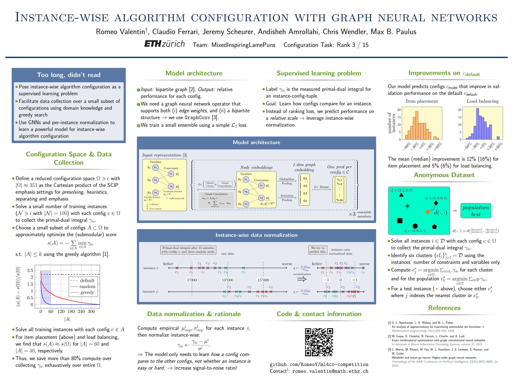

## Machine Learning for Combinatorial Optimization - NeurIPS 2021 Competition (Configuration task)
### This is the code repository of team "MixedInspiredLamePuns"
> Note that this repository is forked from [github.com/ds4dm/ml4co-competition](https://github.com/ds4dm/ml4co-competition). See [here](https://www.ecole.ai/2021/ml4co-competition/) for the official competition website.

> For a related application, trying to explore the dataset using Bayesian Optimization, check out the [bo_gnn_seminar](https://github.com/RomeoV/ml4co-competition/tree/bo_gnn_seminar) branch.


[**Leaderboard results**](https://www.ecole.ai/2021/ml4co-competition/#leaderboard)

- rank 3 / 15 on the global leaderboard
- rank 1 / 7 on the student leaderboard

### Poster
See also the [pdf version](./figs/MixedInspiringLamePuns_poster.pdf).



### Code structure
```
.
├── bo_gnn                              <-- main directory
│   └── config
│       ├── conda.yaml
│       ├── config_utils.py
│       ├── data_utils
│       │   ├── dataset.py              <-- dataset loader
│       │   └── milp_data.py            <-- bipartite graph representation
│       ├── Dockerfile.cpu              <-- Dockefile for data generation
│       ├── Dockerfile.gpu              <-- Dockerfile for GNN training
│       ├── generate_data.py            <-- massively parallel data generation script
│       ├── models
│       │   ├── baseline.py             <-- GNN definition
│       │   └── callbacks.py
│       ├── mps_to_pkl.py
│       ├── plot_run_performance.py
│       ├── scripts
│       └── train_gnn.py                <-- main training loop & ensembling
├── common                              <-- pre-defined evaluation environments
│   ├── environments.py
│   ├── evaluate.py
│   └── rewards.py
├── instances                           <-- raw data location
├── README.md
├── submissions                         <-- submission code
│   └── MixedInspiringLamePuns
│       ├── agents
│       ├── callbacks.py
│       ├── conda.yaml
│       ├── data_utils
│       ├── heuristics_schedules
│       ├── init.sh
│       ├── models
│       ├── param_configurations
│       ├── parameter_configuration_mapping
│       ├── results
│       ├── trained_model_checkpoints
│       └── train_gnn.py
└── TASKS.md

```
