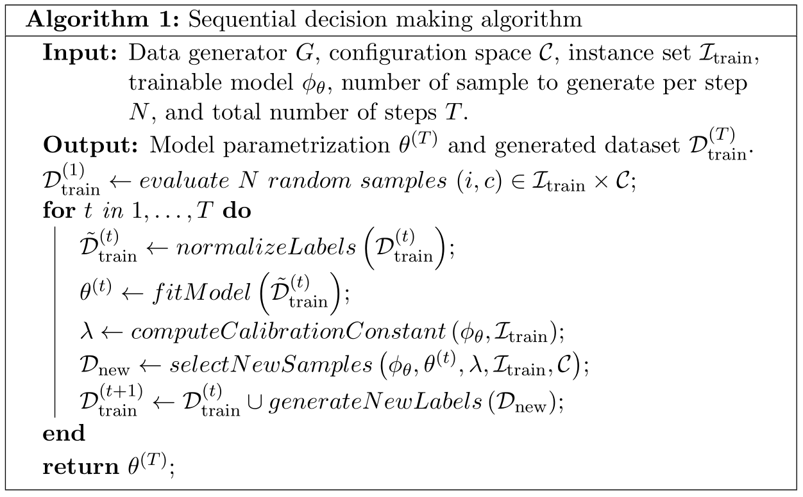

## ML4CO: Bayesian Optimization with ensembled GNNs
### This is the code repository for my semester project
> For a related competition entry (without Bayesian Optimization), check out the [feature/final-submission](https://github.com/RomeoV/ml4co-competition/tree/feature/final-submission) branch.

### Main algorithm


### Report
Find the corresponding writeup [here](./figs/RomeoValentin_semester_project_addendum_BO_with_GNNs.pdf).

### Running the code

```bash
$ cd bo_gnn/config
$ # check hardcoded paths in `schedule_new_iteration.sh`
$ bash schedule_new_iteration <RUN_ID> 0
$ # success!
```

### Code structure
```
.
├── bo_gnn
│   ├── config
│   │   ├── conda.yaml
│   │   ├── data
│   │   ├── data_utils
│   │   │   ├── dataset.py                       <-- data loader
│   │   │   └── milp_data.py                     <-- bipartite dataset definition
│   │   ├── Dockerfile.gpu                       <-- Dockefile to run everything
│   │   ├── generate_data.py                     <-- parallel data generator
│   │   ├── make_new_tasks.py                    <-- query latest model and generate new tasks
│   │   ├── make_new_validation_tasks.py         <-- judge how well the model is currently doing
│   │   ├── models
│   │   │   ├── baseline.py                      <-- GNN definition
│   │   │   ├── callbacks.py
│   │   │   └── trainable.py                     <-- model ensembling and pytorch-lightning module
│   │   ├── runs
│   │   ├── schedule_new_iteration.sh            <-- self-calling task scheduler (at the heart of the algorithm)
│   │   ├── scripts
│   │   └── train_gnn.py                         <-- continue training the GNN on the latest data
├── instances
└── README.md

```
